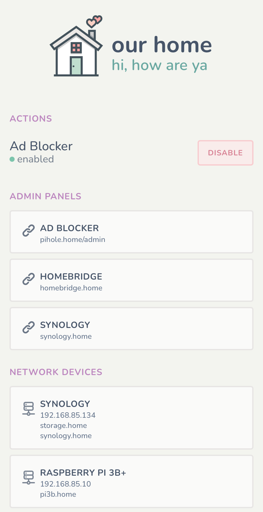

# Our Home

<p align="left">
  
</p>

> ### A simple smart home dashboard

Screenshot taken on an iPhone 11. Deployed with docker and configured to run at
`http://our.home`. Saved from Safari to the homescreen as a progressive web app
with a custom icon.

The above build features an action to temporarily disable Pihole Adblocker.
Also includes links to admin panels and references to commonly used network
devices.

Built in Elixir, Phoenix, LiveView, and Tailwind CSS.

## Getting started

Clone the project locally. Create a copy of the environmental variables:

```bash
cp .env.example .env
```

Edit `.env` and configure values.

```bash
vim .env
```

Get `mix` dependencies:

```bash
mix deps.get
```

Start the server:

```bash
bin/start
```

## Building with Docker

Build an image:

```bash
bin/docker-build
```

Once done, the `our_home:latest` build will be available in Docker.

An example of a deploying with Docker Compose with a `docker-compose.yml` file:

```yaml
version: '2'

services:
  our_home:
    container_name: our_home
    image: our_home:latest
    ports:
      - "4000:4000/tcp"
    environment:
      OUR_HOME_DOMAIN: "our.home"
      OUR_HOME_PORT: "4000"
      OUR_HOME_DATABASE_PATH: "/home/elixir/app/data/our_home.prod.db"
      OUR_HOME_DATABASE_POOL_SIZE: 5
      OUR_HOME_SECRET_KEY_BASE: "8Hv5G4DVP0+nWYeWtoTFEmhfrkME0umdO4WLJUN0bI/OYYgc1dmFF6j+shkvsOJA"
      PIHOLE_API_AUTH_TOKEN: "16f5b354545357fd02f2b66800a4f59a475fedc1329fa3ee7276d0056b04191b"
      PIHOLE_API_DOMAIN: "pihole.home"
    restart: unless-stopped
```

## Acknowledgements

- House icon by [Vandelay Design](https://www.iconfinder.com/icons/2903201/house_love_icon)
